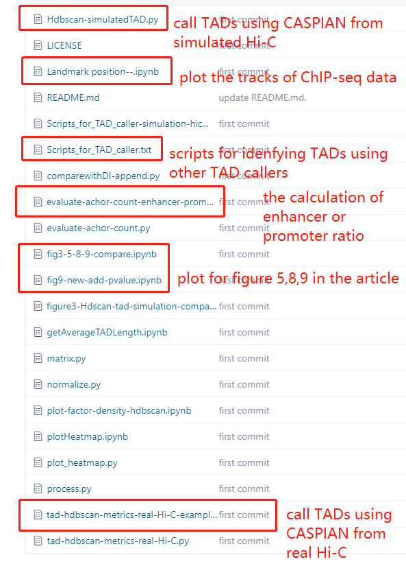

# CASPIAN: A Method to Identify Chromatin Structure based on Spatial Distance
Requirment:

python version:3.6.12

python package:

pip install numpy

pip install matplotlib

pip install seaborn

pip install heapq

pip install argparse

pip install math

pip install hdbscan

pip install sklearn
## 0. Directory
TAD_results/SimulationData:

*.tad:TAD files with a format (start bin, start site,end bin, end site)

\*.hic:simulated Hi-C contact matrix, N\*N format

TAD_results/SimulationData/res_150_TAD:

\*.tad:TAD files with a format (start bin, start site,end bin, end site)

\*_TADlike_alpha_\*_set0.txt:simulated Hi-C contact matrix, N\*N format

 
TAD_results / GM2878 /*: TAD results of GM12878 cell line Hi-C data, we do not provide the real Hi-C contact matrix due to the bigsize of files.

## 1. Hi-C Data used in this study:
In our study, the simulated Hi-C data is provided by the paper "Forcato, M. et al. Comparison of computational methods for Hi-C data analysis. Nature methods 14, 679-685 (2017)."

The real Hi-C data of GM12878 cell line with GEO ID GSE63525 is provided by the Rao Lab.

## 2. Input matrix file format:
The input to CASPIAN is a tab seperated N by N intra-chromosomal contact matrix derived from Hi-C data, where N is the number of equal-sized regions of a chromosome.

## 3. Usage:

1) run the file "Hdbscan-simulatedTAD.py" from simualted Hi-C data to get TADs by just changing the the directoy of hic file and the output file. 

2) run the 'tad-hdbscan-metrics-real-Hi-C-example.py' from real Hi-C data to get TADs by just changing the the directoy of hic file

3) output: TAD files and quality file. 

4) evaluate-achor-count.py,evaluate_TADs.py are used to evalute the anchor ratio of facotrs.

5) plotHeatmap.ipynb and plot_heatmap.py is used to plot the TADs boundaries on the Hi-C heatmap.

6) Landmark position--.ipynb:plot the ChIP-seq signal marks.

7)the directory of "TAD_results" contains the results of TADs called from simualted Hi-C and real Hi-C.

8)Scripts_for_TAD_caller-simulation-hic.txt: The scripts of identifying TADs by using other TAD callers.

